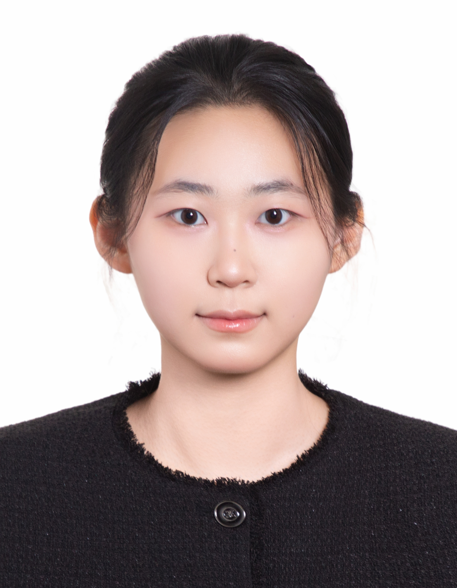

## Biography

<a href="https://www.linkedin.com/in/eunseo-song-65543a393/">Eunseo Song</a> is an undergraduate student in the School of <a href="https://cse.ssu.ac.kr/">Computer Science and Engineering</a> at Soongsil University. She is currently conducting research at the <a href="https://sites.google.com/view/ssu-nlp/home">Natural Language Processing Lab</a>. Her research interests include natural language processing (NLP) and large language models (LLMs), with a particular focus on how LLMs understand and use human language and how their abilities can be evaluated reliably. For more details, please see her <a href="./cv/EunseoSong_CV.pdf">CV</a>.

## Research Interests

* Large Language Models (LLMs)
* Natural Language Processing (NLP)

## Education

* **2024.03 - 2028.02 (Expected)**: B.S. in <a href="https://cse.ssu.ac.kr/">Computer Science and Engineering</a>, Soongsil University (Advisor: <a href="https://parkchanjun.github.io/">Prof. Chanjun Park</a>)  

## Work Experiences

* **2026.08 - Now**: <a href="https://sites.google.com/view/ssu-nlp/home">Natural Language Processing Lab</a>, Soongsil University, Researcher  
* **2024.07 - 2026.08**: <a href="https://univai.co.kr/">UnivAI</a>, Co-founder & Software Engineer 

## Additional Links

* <a href="https://github.com/eunseo9311">GitHub</a>.
* <a href="https://scholar.google.com/citations?user=VDWuOq0AAAAJ&hl=ko">Google Scholar</a>.
